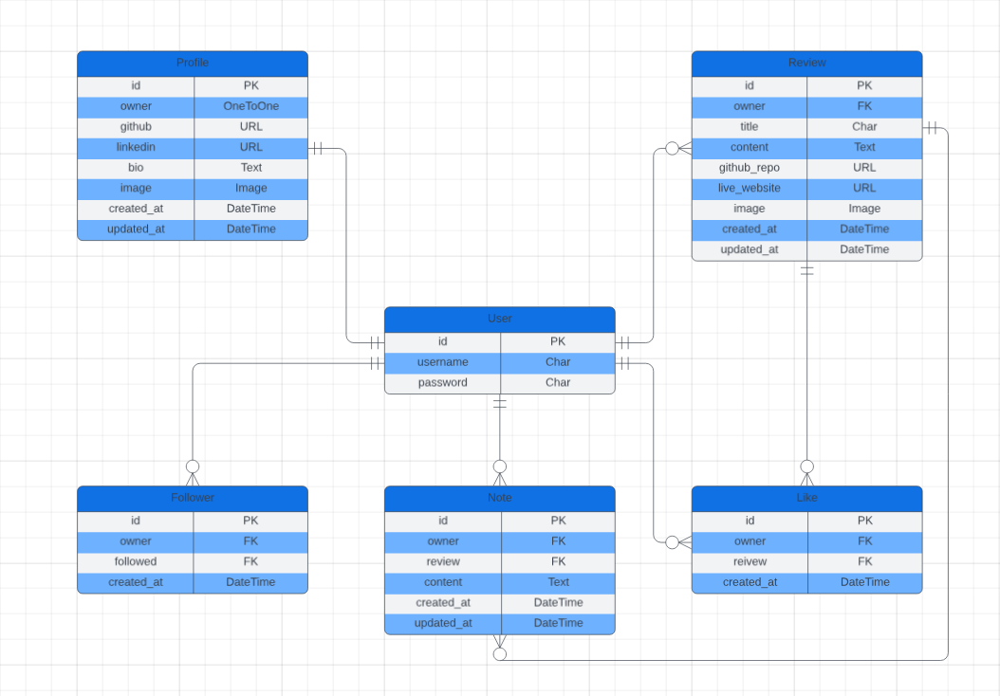
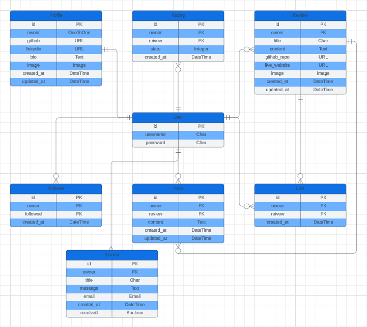

# STAR REVIEW API

API for star review app.
You can find detailed information in [Front-end repo](https://github.com/JohnnySonTrinh/review-app).

[](https://github.com/JohnnySonTrinh/review-api/commits/main)
[](https://github.com/JohnnySonTrinh/review-api/commits/main)
[](https://github.com/JohnnySonTrinh/review-api)

## Tools & Technologies Used

- [](https://tim.2bn.dev/markdown-builder) used to generate README and TESTING templates.
- [](https://git-scm.com) used for version control. (`git add`, `git commit`, `git push`)
- [](https://github.com) used for secure online code storage.
- [](https://gitpod.io) used as a cloud-based IDE for development.
- [](https://www.python.org) used as the back-end programming language.
- [](https://www.heroku.com) used for hosting the deployed back-end site.
- [](https://www.djangoproject.com) used as the Python framework for the site.
- [](https://www.postgresql.org) used as the relational database management.
- [](https://cloudinary.com) used for online static file storage.
- [](https://whitenoise.readthedocs.io) used for serving static files with Heroku.
- [](https://fontawesome.com) used for the icons.
- [](https://chat.openai.com) used to help debug, troubleshoot, and explain things

## Database Model

This project is built on a relational database, using PostgreSQL. The various elements of this project are related to each other in a number of ways, mostly via user primary keys assigned as foreignkeys to different elements.

<details>
<summary> Click here to see old ERD </summary>

#### Without Rating and Tickets Model

- 

</details>

### Updated ERD



### Profile Model

```python
class Profile(models.Model):
    owner = models.OneToOneField(User, on_delete=models.CASCADE)
    created_on = models.DateTimeField(auto_now_add=True)
    updated_on = models.DateTimeField(auto_now=True)
    name = models.CharField(max_length=255, blank=True)
    content = models.TextField(max_length=1000, blank=True)
    image = models.ImageField(
        upload_to='images/', default='../default_profile_xw5she'
    )
    github = models.URLField(max_length=200, blank=True)
    linkedin = models.URLField(max_length=200, blank=True)

    class Meta:
        ordering = ['-created_on']

    def __str__(self):
        return f"{self.owner}'s profile"
```

### Review Model

```python
class Review(models.Model):
    """
    Model for a review post. stores the title, content, github repo,
    live website, image, created_on, updated_on.
    """
    owner = models.ForeignKey(User, on_delete=models.CASCADE)
    created_on = models.DateTimeField(auto_now_add=True)
    updated_on = models.DateTimeField(auto_now=True)
    title = models.CharField(max_length=255, blank=False)
    content = models.TextField(max_length=1000, blank=True)
    github_repo = models.URLField(
        blank=True,
        max_length=255,
    )
    live_website = models.URLField(
        blank=True,
        max_length=255,
    )
    image = models.ImageField(
        upload_to='images/',
        default='../default_post_fe0uhn'
    )

    class Meta:
        ordering = ['created_on']

    def __str__(self):
        return f'{self.id} - {self.title}'
```

### Note Model

```python
class Note(models.Model):
    """
    Note model, related to User and Review
    """
    owner = models.ForeignKey(User, on_delete=models.CASCADE)
    review = models.ForeignKey(Review, on_delete=models.CASCADE)
    created_on = models.DateTimeField(auto_now_add=True)
    updated_on = models.DateTimeField(auto_now=True)
    content = models.TextField()

    class Meta:
        ordering = ['-created_on']

    def __str__(self):
        return self.content
```

### Like Model

```python
class Like(models.Model):
    """
    Like model, related to 'owner' and 'review'.
    'owner' is a User instance and 'review' is a review instance.
    'unique_together' makes sure a user can't like the same review twice.
    """
    owner = models.ForeignKey(User, on_delete=models.CASCADE)
    review = models.ForeignKey(
        Review, related_name='likes', on_delete=models.CASCADE
    )
    created_on = models.DateTimeField(auto_now_add=True)

    class Meta:
        ordering = ['-created_on']
        unique_together = ['owner', 'review']

    def __str__(self):
        return f'{self.owner} {self.review}'
```

### Follower Model

```python
class Follower(models.Model):
    """
    Follower model, related to 'owner' and 'followed'.
    'owner' is a User that is following a User.
    'followed' is a User that is followed by 'owner'.
    We need the related_name attribute so that django can differentiate.
    between 'owner' and 'followed' who both are User model instances.
    'unique_together' makes sure a user can't 'double follow' the same user.
    """
    owner = models.ForeignKey(
        User, related_name='following', on_delete=models.CASCADE
    )
    followed = models.ForeignKey(
        User, related_name='followed', on_delete=models.CASCADE
    )
    created_on = models.DateTimeField(auto_now_add=True)

    class Meta:
        ordering = ['-created_on']
        unique_together = ['owner', 'followed']

    def __str__(self):
        return f'{self.owner} {self.followed}'
```

### Rating Model

```python
from django.db import models
from django.contrib.auth.models import User
from reviews.models import Review


class Rating(models.Model):
    """
    Rating model, related to 'owner' and 'review'.
    'owner' is a User instance and 'review' is a review instance.
    'stars' is an integer field with choices from 1 to 5.
    'unique_together' ensures a user can't rate the same review twice.
    """
    owner = models.ForeignKey(User, on_delete=models.CASCADE)
    review = models.ForeignKey(
        Review, related_name='ratings', on_delete=models.CASCADE
    )
    stars = models.IntegerField(choices=[(i, str(i)) for i in range(1, 6)])
    created_on = models.DateTimeField(auto_now_add=True)

    class Meta:
        ordering = ['-created_on']
        unique_together = ['owner', 'review']

    def __str__(self):
        return f'{self.owner} rated {self.review} - {self.stars} stars'

```

### Ticket Model

```python
from django.db import models
from django.contrib.auth.models import User


class Ticket(models.Model):
    """
    A model for users to submit inquiries or support tickets.
    """
    owner = models.ForeignKey(
        User, on_delete=models.CASCADE, related_name='tickets'
        )
    title = models.CharField(max_length=255)
    message = models.TextField()
    email = models.EmailField()
    created_on = models.DateTimeField(auto_now_add=True)
    resolved = models.BooleanField(default=False)

    def __str__(self):
        return f'Ticket {self.id} from {self.owner.username}'

```

## Testing

> [!NOTE]  
> For all testing, please refer to the [TESTING.md](TESTING.md) file.

## Deployment

The live deployed application can be found deployed on [Heroku](https://star-review-api-99b8eca24b61.herokuapp.com).

This section provides a step-by-step guide to deploy the Django application with a Heroku and PostgreSQL database.

### Cloudinary API

This project uses the [Cloudinary API](https://cloudinary.com) to store media assets online, due to the fact that Heroku doesn't persist this type of data.

To obtain your own Cloudinary API key, create an account and log in.

- For _Primary interest_, you can choose _Programmable Media for image and video API_.
- Optional: _edit your assigned cloud name to something more memorable_.
- On your Cloudinary Dashboard, you can copy your **API Environment Variable**.
- Be sure to remove the `CLOUDINARY_URL=` as part of the API **value**; this is the **key**.

<details>
<summary> Click here to run the commands to change profile images </summary>

### Update user image

- Upload Avatar images to Cloudinary
- Run the command `python manage.py update_profile_image <username>` for single profile avatar image

  OR

- Run the command `update_profiles_images` for all profiles avatar images

```python
import random
from django.core.management.base import BaseCommand
from profiles.models import Profile


class Command(BaseCommand):
    help = 'Update a profile image to a random default image'

    # List of default images
    DEFAULT_IMAGES = [
        # '../default_profile_h8s2sm.webp',
        # '../default_profile_kxm3io.webp',
        '../default_profile_xw5shd.webp',
    ]

    def add_arguments(self, parser):
        parser.add_argument(
            'username', type=str,
            help=(
                'The username of the user whose profile image '
                'needs to be updated'
            )
        )

    def handle(self, *args, **kwargs):
        username = kwargs['username']
        try:
            profile = Profile.objects.get(owner__username=username)
            profile.image = random.choice(self.DEFAULT_IMAGES)
            profile.save()
            self.stdout.write(
                self.style.SUCCESS(
                    f'Successfully updated profile image for user {username}'
                )
            )
        except Profile.DoesNotExist:
            self.stdout.write(
                self.style.ERROR(
                    f'Profile for user {username} does not exist'
                )
            )

```

</details>

### Prerequisites

Before deploying, ensure you have the following:

- A Heroku account. [Sign up here](https://signup.heroku.com/) if you don't have one.
- [Heroku CLI](https://devcenter.heroku.com/articles/heroku-cli) installed on your machine.
- Git installed on your machine.

### Deploying to Heroku

1. **Log in to Heroku**: Open your terminal and log in to Heroku using the Heroku CLI:

   ```
   heroku login
   ```

2. **Create a Heroku App**: Create a new Heroku app:

   ```
   heroku create your-app-name
   ```

   Replace `your-app-name` with the desired name for your application on Heroku.

3. **Add Heroku PostgreSQL**: Add the Heroku PostgreSQL add-on to your app:

   ```
   heroku addons:create heroku-postgresql:hobby-dev --app your-app-name
   ```

   This will provision a new Postgres database for your application.

4. **Configure Environment Variables**: Set the necessary environment variables such as `SECRET_KEY`, `DEBUG`, and any other variables you need for your project:

   ```
   heroku config:set SECRET_KEY='your_secret_key' DEBUG=False --app your-app-name
   ```

5. **Push Code to Heroku**: Push your code from your Git repository to Heroku:

   ```
   git push heroku master
   ```

   If you're pushing a non-master branch, use `git push heroku your-branch:master`.

6. **Run Migrations**: Once your code is deployed, run your migrations:

   ```
   heroku run python manage.py migrate --app your-app-name
   ```

7. **Create a Superuser**: Create an administrative user:

   ```
   heroku run python manage.py createsuperuser --app your-app-name
   ```

8. **Open the App**: Open your deployed app in a web browser:

   ```
   heroku open --app your-app-name
   ```

### PostgreSQL Database

The application uses PostgreSQL as its database provided by Heroku. Upon deployment, the database URL is automatically added to your app's configuration under the `DATABASE_URL` environment variable. The application is configured to use this variable in production.

For local development, make sure to update your `settings.py` to use the `DATABASE_URL`:

```python
import dj_database_url
DATABASES['default'] = dj_database_url.config(conn_max_age=600, ssl_require=True)
```

Make sure you have `dj-database-url` in your requirements file to parse the `DATABASE_URL` environment variable:

```
pip install dj-database-url
```

### Final Steps

After deployment, check the logs to ensure everything is running smoothly:

```
heroku logs --tail --app your-app-name
```

For further information on troubleshooting or advanced configurations, consult the Heroku Dev Center or this application's documentation.

### Heroku Deployment

This project uses [Heroku](https://www.heroku.com), a platform as a service (PaaS) that enables developers to build, run, and operate applications entirely in the cloud.

Deployment steps are as follows, after account setup:

- Select **New** in the top-right corner of your Heroku Dashboard, and select **Create new app** from the dropdown menu.
- Your app name must be unique, and then choose a region closest to you (EU or USA), and finally, select **Create App**.
- From the new app **Settings**, click **Reveal Config Vars**, and set your environment variables.

> [!IMPORTANT]  
> This is a sample only; you would replace the values with your own if cloning/forking my repository.

| Key              | Value            |
| ---------------- | ---------------- |
| `CLOUDINARY_URL` | user's own value |
| `DATABASE_URL`   | user's own value |
| `SECRET_KEY`     | user's own value |
| `DEV`            | 1                |

Heroku needs three additional files in order to deploy properly.

- requirements.txt
- Procfile

You can install this project's **requirements** (where applicable) using:

- `pip3 install -r requirements.txt`

If you have your own packages that have been installed, then the requirements file needs updated using:

- `pip3 freeze --local > requirements.txt`

The **Procfile** can be created with the following command:

- `echo web: gunicorn app_name.wsgi > Procfile`
- _replace **app_name** with the name of your primary Django app name; the folder where settings.py is located_

The **runtime.txt** file needs to know which Python version you're using:

1. type: `python3 --version` in the terminal.
2. in the **runtime.txt** file, add your Python version:
   - `python-3.9.18`

For Heroku deployment, follow these steps to connect your own GitHub repository to the newly created app:

Either:

- Select **Automatic Deployment** from the Heroku app.

Or:

- In the Terminal/CLI, connect to Heroku using this command: `heroku login -i`
- Set the remote for Heroku: `heroku git:remote -a app_name` (replace _app_name_ with your app name)
- After performing the standard Git `add`, `commit`, and `push` to GitHub, you can now type:
  - `git push heroku main`

The project should now be connected and deployed to Heroku!

### Cloning

You can clone the repository by following these steps:

1. Go to the [GitHub repository](https://github.com/JohnnySonTrinh/coach-api)
2. Locate the Code button above the list of files and click it
3. Select if you prefer to clone using HTTPS, SSH, or GitHub CLI and click the copy button to copy the URL to your clipboard
4. Open Git Bash or Terminal
5. Change the current working directory to the one where you want the cloned directory
6. In your IDE Terminal, type the following command to clone my repository:
   - `git clone https://github.com/JohnnySonTrinh/coach-api.git`
7. Press Enter to create your local clone.

Alternatively, if using Gitpod, you can click below to create your own workspace using this repository.

[](https://gitpod.io/#https://github.com/JohnnySonTrinh/coach-api)

Please note that in order to directly open the project in Gitpod, you need to have the browser extension installed.
A tutorial on how to do that can be found [here](https://www.gitpod.io/docs/configure/user-settings/browser-extension).

### Forking

By forking the GitHub Repository, we make a copy of the original repository on our GitHub account to view and/or make changes without affecting the original owner's repository.
You can fork this repository by using the following steps:

1. Log in to GitHub and locate the [GitHub Repository](https://github.com/JohnnySonTrinh/coach-api)
2. At the top of the Repository (not top of page) just above the "Settings" Button on the menu, locate the "Fork" Button.
3. Once clicked, you should now have a copy of the original repository in your own GitHub account!

### Local VS Deployment

#### Environment Variables

- **Local**: Environment variables might be set directly in me development environment or stored in a .env file that is not committed to version control for security reasons.
- **Deployment**: On Heroku, environment variables should be set through the platform's settings (Config Vars) to keep sensitive information like database URLs, secret keys, and third-party API keys secure.

#### Database

- **Local**: I use SQLite as your database for simplicity and ease of setup in a local development environment.
- **Deployment**: On Heroku, I use a more robust database like PostgreSQL. Heroku offers its own PostgreSQL service, which can be easily integrated into the project.

## Content

| Source                                                          | Location        | Notes                               |
| --------------------------------------------------------------- | --------------- | ----------------------------------- |
| [Chris Beams](https://chris.beams.io/posts/git-commit)          | version control | "How to Write a Git Commit Message" |
| [DRF API](https://www.youtube.com/@mediaupload2326)             | entire app      | API Walkthrough                     |
| [Django docs](https://docs.djangoproject.com/en/5.0/)           | entire site     | Django/python syntax                |
| [Django Rest Framework](https://www.django-rest-framework.org/) | API             | DRF docs                            |
