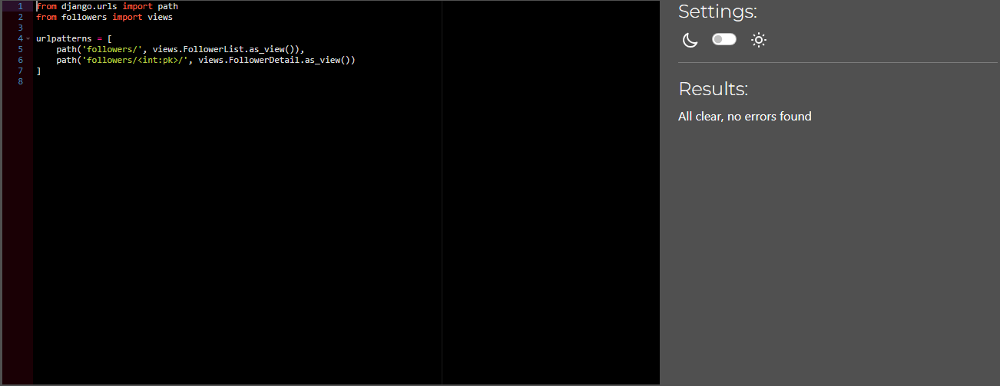
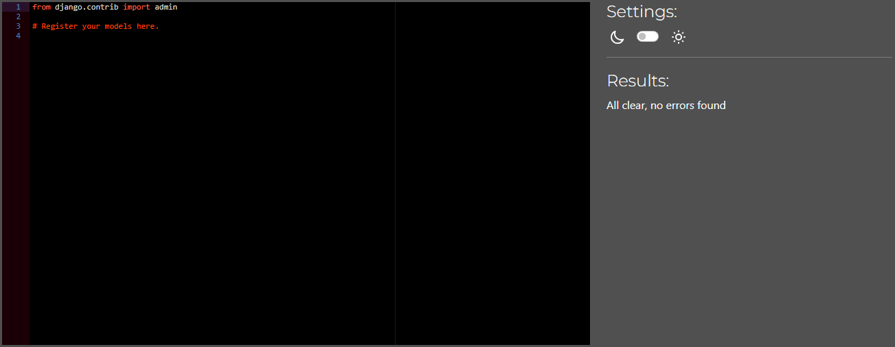
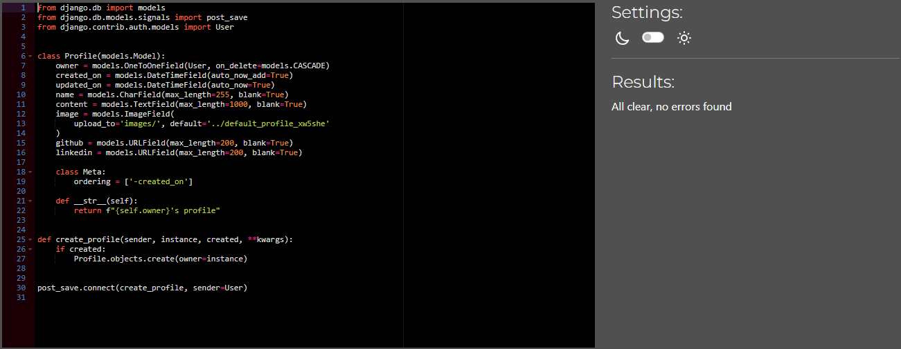
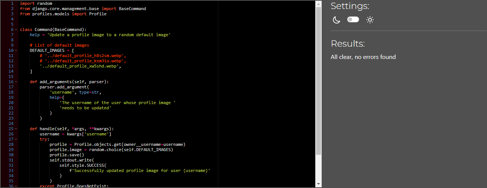

# Testing

> [!NOTE]  
> Return back to the [README.md](README.md) file.

## Code Validation

### Python

I have used the recommended [PEP8 CI Python Linter](https://pep8ci.herokuapp.com) to validate all of my Python files.

| Directory | File                      | CI URL                                                                                                                                                          | Screenshot                                                        | Notes                                   |
| --------- | ------------------------- | --------------------------------------------------------------------------------------------------------------------------------------------------------------- | ----------------------------------------------------------------- | --------------------------------------- |
| drf_api   | permissions.py            | [PEP8 CI](https://pep8ci.herokuapp.com/https://raw.githubusercontent.com/JohnnySonTrinh/review-api/main/drf_api/permissions.py)                                 |    | ✅                                      |
| drf_api   | serializers.py            | [PEP8 CI](https://pep8ci.herokuapp.com/https://raw.githubusercontent.com/JohnnySonTrinh/review-api/main/drf_api/serializers.py)                                 |    | ✅                                      |
| drf_api   | settings.py               | [PEP8 CI](https://pep8ci.herokuapp.com/https://raw.githubusercontent.com/JohnnySonTrinh/review-api/main/drf_api/settings.py)                                    |       | ✅                                      |
| drf_api   | urls.py                   | [PEP8 CI](https://pep8ci.herokuapp.com/https://raw.githubusercontent.com/JohnnySonTrinh/review-api/main/drf_api/urls.py)                                        |           | ✅                                      |
| drf_api   | views.py                  | [PEP8 CI](https://pep8ci.herokuapp.com/https://raw.githubusercontent.com/JohnnySonTrinh/review-api/main/drf_api/views.py)                                       |          | ✅                                      |
| followers | admin.py                  | [PEP8 CI](https://pep8ci.herokuapp.com/https://raw.githubusercontent.com/JohnnySonTrinh/review-api/main/followers/admin.py)                                     |        | ✅                                      |
| followers | models.py                 | [PEP8 CI](https://pep8ci.herokuapp.com/https://raw.githubusercontent.com/JohnnySonTrinh/review-api/main/followers/models.py)                                    |       | ✅                                      |
| followers | serializers.py            | [PEP8 CI](https://pep8ci.herokuapp.com/https://raw.githubusercontent.com/JohnnySonTrinh/review-api/main/followers/serializers.py)                               |  | ✅                                      |
| followers | urls.py                   | [PEP8 CI](https://pep8ci.herokuapp.com/https://raw.githubusercontent.com/JohnnySonTrinh/review-api/main/followers/urls.py)                                      |         | ✅                                      |
| followers | views.py                  | [PEP8 CI](https://pep8ci.herokuapp.com/https://raw.githubusercontent.com/JohnnySonTrinh/review-api/main/followers/views.py)                                     |        | ✅                                      |
| likes     | admin.py                  | [PEP8 CI](https://pep8ci.herokuapp.com/https://raw.githubusercontent.com/JohnnySonTrinh/review-api/main/likes/admin.py)                                         |            | ✅                                      |
| likes     | models.py                 | [PEP8 CI](https://pep8ci.herokuapp.com/https://raw.githubusercontent.com/JohnnySonTrinh/review-api/main/likes/models.py)                                        |           | ✅                                      |
| likes     | serializers.py            | [PEP8 CI](https://pep8ci.herokuapp.com/https://raw.githubusercontent.com/JohnnySonTrinh/review-api/main/likes/serializers.py)                                   |      | ✅                                      |
| likes     | urls.py                   | [PEP8 CI](https://pep8ci.herokuapp.com/https://raw.githubusercontent.com/JohnnySonTrinh/review-api/main/likes/urls.py)                                          |             | ✅                                      |
| likes     | views.py                  | [PEP8 CI](https://pep8ci.herokuapp.com/https://raw.githubusercontent.com/JohnnySonTrinh/review-api/main/likes/views.py)                                         |            | ✅                                      |
|           | manage.py                 | [PEP8 CI](https://pep8ci.herokuapp.com/https://raw.githubusercontent.com/JohnnySonTrinh/review-api/main/manage.py)                                              |                 | ✅                                      |
| notes     | admin.py                  | [PEP8 CI](https://pep8ci.herokuapp.com/https://raw.githubusercontent.com/JohnnySonTrinh/review-api/main/notes/admin.py)                                         |            | ✅                                      |
| notes     | models.py                 | [PEP8 CI](https://pep8ci.herokuapp.com/https://raw.githubusercontent.com/JohnnySonTrinh/review-api/main/notes/models.py)                                        |           | ✅                                      |
| notes     | serializers.py            | [PEP8 CI](https://pep8ci.herokuapp.com/https://raw.githubusercontent.com/JohnnySonTrinh/review-api/main/notes/serializers.py)                                   |      | ✅                                      |
| notes     | urls.py                   | [PEP8 CI](https://pep8ci.herokuapp.com/https://raw.githubusercontent.com/JohnnySonTrinh/review-api/main/notes/urls.py)                                          |             | ✅                                      |
| notes     | views.py                  | [PEP8 CI](https://pep8ci.herokuapp.com/https://raw.githubusercontent.com/JohnnySonTrinh/review-api/main/notes/views.py)                                         |            | ✅                                      |
| profiles  | admin.py                  | [PEP8 CI](https://pep8ci.herokuapp.com/https://raw.githubusercontent.com/JohnnySonTrinh/review-api/main/profiles/admin.py)                                      |         | ✅                                      |
| profiles  | models.py                 | [PEP8 CI](https://pep8ci.herokuapp.com/https://raw.githubusercontent.com/JohnnySonTrinh/review-api/main/profiles/models.py)                                     |        | ✅                                      |
| profiles  | serializers.py            | [PEP8 CI](https://pep8ci.herokuapp.com/https://raw.githubusercontent.com/JohnnySonTrinh/review-api/main/profiles/serializers.py)                                |   | ✅                                      |
| profiles  | urls.py                   | [PEP8 CI](https://pep8ci.herokuapp.com/https://raw.githubusercontent.com/JohnnySonTrinh/review-api/main/profiles/urls.py)                                       |          | ✅                                      |
| profiles  | views.py                  | [PEP8 CI](https://pep8ci.herokuapp.com/https://raw.githubusercontent.com/JohnnySonTrinh/review-api/main/profiles/views.py)                                      |         | ✅                                      |
| reviews   | admin.py                  | [PEP8 CI](https://pep8ci.herokuapp.com/https://raw.githubusercontent.com/JohnnySonTrinh/review-api/main/reviews/admin.py)                                       |          | ✅                                      |
| reviews   | models.py                 | [PEP8 CI](https://pep8ci.herokuapp.com/https://raw.githubusercontent.com/JohnnySonTrinh/review-api/main/reviews/models.py)                                      |         | ✅                                      |
| reviews   | serializers.py            | [PEP8 CI](https://pep8ci.herokuapp.com/https://raw.githubusercontent.com/JohnnySonTrinh/review-api/main/reviews/serializers.py)                                 |    | ✅                                      |
| reviews   | urls.py                   | [PEP8 CI](https://pep8ci.herokuapp.com/https://raw.githubusercontent.com/JohnnySonTrinh/review-api/main/reviews/urls.py)                                        |           | ✅                                      |
| reviews   | views.py                  | [PEP8 CI](https://pep8ci.herokuapp.com/https://raw.githubusercontent.com/JohnnySonTrinh/review-api/main/reviews/views.py)                                       |          | ✅                                      |
| ratings   | admin.py                  | [PEP8 CI](https://pep8ci.herokuapp.com/https://raw.githubusercontent.com/JohnnySonTrinh/review-api/main/ratings/admin.py)                                       |          | ✅                                      |
| ratings   | models.py                 | [PEP8 CI](https://pep8ci.herokuapp.com/https://raw.githubusercontent.com/JohnnySonTrinh/review-api/main/ratings/models.py)                                      |         | ✅                                      |
| ratings   | serializers.py            | [PEP8 CI](https://pep8ci.herokuapp.com/https://raw.githubusercontent.com/JohnnySonTrinh/review-api/main/ratings/serializers.py)                                 |    | ✅                                      |
| ratings   | urls.py                   | [PEP8 CI](https://pep8ci.herokuapp.com/https://raw.githubusercontent.com/JohnnySonTrinh/review-api/main/ratings/urls.py)                                        |           | E501 line too long (82 > 79 characters) |
| ratings   | views.py                  | [PEP8 CI](https://pep8ci.herokuapp.com/https://raw.githubusercontent.com/JohnnySonTrinh/review-api/main/ratings/views.py)                                       |          | ✅                                      |
| tickets   | admin.py                  | [PEP8 CI](https://pep8ci.herokuapp.com/https://raw.githubusercontent.com/JohnnySonTrinh/review-api/main/tickets/admin.py)                                       |          | ✅                                      |
| tickets   | models.py                 | [PEP8 CI](https://pep8ci.herokuapp.com/https://raw.githubusercontent.com/JohnnySonTrinh/review-api/main/tickets/models.py)                                      |         | ✅                                      |
| tickets   | serializers.py            | [PEP8 CI](https://pep8ci.herokuapp.com/https://raw.githubusercontent.com/JohnnySonTrinh/review-api/main/tickets/serializers.py)                                 |    | ✅                                      |
| tickets   | urls.py                   | [PEP8 CI](https://pep8ci.herokuapp.com/https://raw.githubusercontent.com/JohnnySonTrinh/review-api/main/tickets/urls.py)                                        |           | ✅                                      |
| tickets   | views.py                  | [PEP8 CI](https://pep8ci.herokuapp.com/https://raw.githubusercontent.com/JohnnySonTrinh/review-api/main/tickets/views.py)                                       |          | ✅                                      |
| profiles  | update_profile_image.py   | [PEP8 CI](https://pep8ci.herokuapp.com/https://raw.githubusercontent.com/JohnnySonTrinh/review-api/main/profiles/management/commands/update_profile_image.py)   |         | ✅                                      |
| profiles  | update_profiles_images.py | [PEP8 CI](https://pep8ci.herokuapp.com/https://raw.githubusercontent.com/JohnnySonTrinh/review-api/main/profiles/management/commands/update_profiles_images.py) |        | ✅                                      |

## Manual Testing

### Testing URLs

|  **URL**         |  **Passed**  |
| ---------------- | ------------ |
| root             | ✅           |
| /profiles/       | ✅           |
| /profiles/:id/   | ✅           |
| /reviews/        | ✅           |
| /reviews/:id/    | ✅           |
| /reviews/create/ | ✅           |
| /notes/          | ✅           |
| /notes/:id       | ✅           |
| /followers/      | ✅           |
| /followers/:id/  | ✅           |
| /likes/          | ✅           |
| /likes/:id/      | ✅           |
| /ratings/        | ✅           |
| /ratings/:id/    | ✅           |
| /tickets/        | ✅           |
| /tickets/:id/    | ✅           |

## Bugs

| Bug                                                               | Screenshot                                 | Fixed | Notes                                                                                                           |
| ----------------------------------------------------------------- | ------------------------------------------ | ----- | --------------------------------------------------------------------------------------------------------------- |
| 400 responses even though the review was posted                   |  | ✅    | Add `return Response(serializer.data, status=status.HTTP_201_CREATED)`                                          |
| Conflict with Django's built-in messages framework                |  | ✅    | Renaming app to "notes" instead of "messages" to avoid the conflict with Django's built-in messaging framework. |
| Missing migrations after connected to Postgres(Reviews and notes) |  | ✅    | Run Command line `python manage.py makemigrations review`... `python manage.py migrate note`...                 |
| CROS HEADER ERROR on frontend second deployed                     |  | ✅    | Update settings.py `CORS_ALLOWED_ORIGINS = ["https://star-review-app-fb4aac8cda63.herokuapp.com",]`             |

## Unfixed Bugs

- The "Change Avatar" bug remains unresolved, and it appears that the Cloudinary API or profile models are not functioning as intended. Additionally, I have mentioned that there have been multiple migration problems in the backend

- It has been brought to my attention that some issues have been encountered while browsing the application using various devices, including iPad, iPhone (Safari), VPN, and Mac (Safari). During testing, it was observed that the login process was unsuccessful, as the user was redirected to the login page repeatedly during Lighthouse test (incognito). It is suspected that there may be an issue with the JSON Web Token (JWT) system, which is preventing cookies or access tokens from being processed correctly.

- To diagnose the root cause of the issue, it is recommended that a more detailed analysis be conducted to determine whether the issue is related to the frontend or backend architecture of the application. A thorough investigation is required to resolve the issue and ensure the user experience is not compromised.

- The section on unfixed bugs remains largely unaddressed due to the project's deadline constraints. I will prioritize efforts to resolve these issues after completing current assessments to ensure the application meets its operational goals and provides a seamless user experience.

> [!NOTE]  
> There are no remaining bugs that I am aware of.
